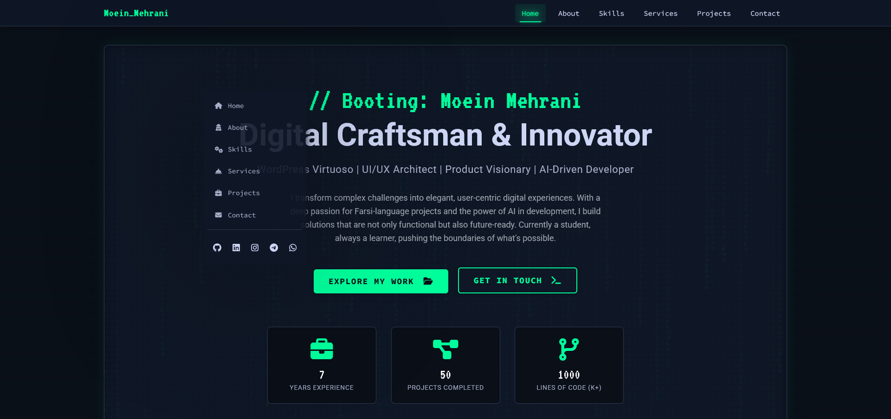

# Moein Mehrani - Personal Portfolio Website

## Overview

This is the personal portfolio website of Moein Mehrani, a passionate UI/UX & Product Designer, WordPress Expert, and AI-Enhanced Developer. This project showcases my skills, experience, and projects in a dynamic, interactive, and modern single-page application (SPA) format.

The website is built entirely with vanilla **HTML, CSS, and JavaScript**, emphasizing Object-Oriented Programming (OOP) principles and a custom client-side router for seamless page transitions without full reloads, mimicking a Virtual DOM behavior.

The design features a distinctive "hacker/matrix" theme, reflecting my interest in technology and cutting-edge development practices.

## Features

* **Single-Page Application (SPA):** Custom client-side routing for smooth navigation between sections (Home, About, Skills, Services, Projects, Contact) without page refresh.
* **Responsive Design:** Fully responsive layout ensuring optimal viewing experience across all devices (desktops, tablets, and mobiles).
* **Interactive UI/UX:**
    * **Text Scramble Loader:** Engaging loading animation for page transitions.
    * **Mouse Glow Effect:** Subtle glow effect following the mouse cursor over interactive boxes.
    * **3D Tilt Effect:** Interactive 3D tilt effect on hover for featured cards.
    * **Custom Context Menu:** A unique right-click menu (desktop only) for quick navigation and social media access, with adaptive positioning.
    * **Animated Elements:** Smooth animations for counters, timeline highlights, and other UI elements.
* **Thematic Design:** A modern "hacker/matrix" theme with a consistent color palette, custom fonts (VT323, Source Code Pro, Roboto), and subtle background effects like Matrix rain.
* **OOP JavaScript:** Codebase structured with Object-Oriented principles for better organization and maintainability.
* **Project Showcase:** Detailed project display with a modal view and pagination.
* **Dynamic Content Loading:** Page content is dynamically rendered using JavaScript.
* **Mobile-First Enhancements:** Includes a matrix-style hamburger menu and a scroll progress indicator for mobile devices.

## Tech Stack

* **Frontend:** HTML5, CSS3 (with Tailwind CSS utility classes for layout), Vanilla JavaScript (ES6+)
* **Design & Theme:** Custom "Hacker/Matrix" theme, responsive design principles.
* **Fonts:** Google Fonts (VT323, Source Code Pro, Roboto)
* **Icons:** Font Awesome

## About Me (Moein Mehrani)

* **WordPress Expert:** 5-7 years of specialized experience in WordPress development, including custom theme and plugin creation from scratch.
* **UI/UX & Product Designer:** Proficient in crafting intuitive user interfaces and engaging user experiences.
* **AI-Enhanced Developer:** Leverages AI tools and methodologies to streamline the development process and build innovative solutions.
* **Focus:** Passionate about Farsi-language projects and continuously exploring new technologies.
* **Skills:** HTML, CSS, JS, TS, PHP, React, Next.js, WordPress, UI/UX Design, Product Design, AI, Photoshop, Figma, Elementor, SEO.

## Setup & Deployment

This project consists of static HTML, CSS, and JavaScript files. No special build process is required.

To deploy on **GitHub Pages**:
1.  Ensure your main HTML file is named `index.html`.
2.  Push the project files to a GitHub repository.
3.  Go to the repository's **Settings** tab.
4.  Navigate to the **Pages** section in the sidebar.
5.  Under "Build and deployment", select **Deploy from a branch** as the source.
6.  Choose the branch you want to deploy from (usually `main` or `master`).
7.  Select the `/(root)` folder.
8.  Click **Save**.
9.  Your site will be available at `https://<your-username>.github.io/<repository-name>/`.

## Future Enhancements (Potential)

* Integration with a headless CMS for easier content management.
* More complex WebGL or Three.js animations.
* Implementing a functional backend for the contact form.

## Connect with Me

* **GitHub:** [moomoein](https://github.com/moomoein) * **LinkedIn:** [moomoein](https://linkedin.com/in/moomoein) * **Instagram:** [@moomoein](https://instagram.com/moomoein) * **Telegram:** [@moomoein](https://t.me/moomoein) *
This project was a great learning experience in building a feature-rich SPA with vanilla JavaScript and focusing on modern UI/UX trends.
